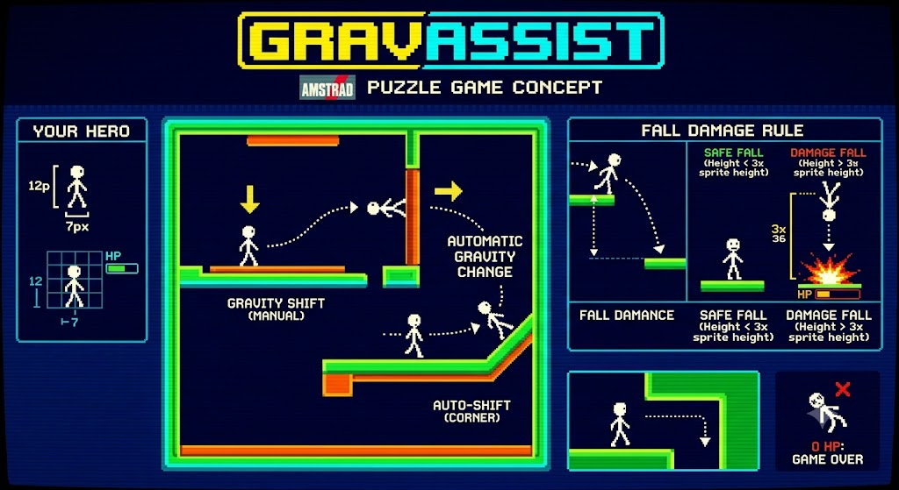

# GRAVASSIST

Puzzle game για **Amstrad CPC 6128**, γραμμένο σε **Z80 assembly**, MODE 1.

Ο ήρωας είναι ένας stick man 7x12 pixels. Δεν πηδάει και δεν πολεμάει — το μόνο του
εργαλείο είναι ότι **αλλάζει την κατεύθυνση της βαρύτητας** — 8 κατευθύνσεις, ανά 45 μοίρες.
Όταν την αλλάζει, πέφτει προς τα εκεί μέχρι να προσγειωθεί, και η επιφάνεια που θα
βρει γίνεται το νέο του πάτωμα. Έτσι περπατάει σε πατώματα, τοίχους και ταβάνια.

Δύο κανόνες κάνουν το παιχνίδι:

- **Στις γωνίες η βαρύτητα ακολουθεί αυτόματα τη γεωμετρία.** Περπατώντας δεν πέφτεις
  ποτέ από πλατφόρμα — τυλίγεσαι γύρω από την ακμή. Πέφτεις μόνο όταν το ζητήσεις.
- **Πτώση πάνω από 36 pixels** (3x το ύψος του ήρωα) κοστίζει ενέργεια. Στο μηδέν,
  τέλος.

Το puzzle δεν είναι η δεξιοτεχνία αλλά η **σειρά των flips**: ποιο τοίχωμα διαλέγεις,
από ποια γωνία θα σε γυρίσει, πόσο ύψος θα πέσεις.



> **Κατάσταση: υπό ανάπτυξη.** Έτοιμα είναι ο sprite pipeline, ο κώδικας περιστροφής
> και ο σκελετός του build. Το gameplay δεν έχει υλοποιηθεί ακόμα — δες
> [plan.md](plan.md) για τα milestones.

---

## Γρήγορη εκκίνηση

```bash
make            # assemble + φτιάχνει build/gravassist.dsk
make test       # επαλήθευση του αλγορίθμου περιστροφής
make clean
```

Φόρτωσε το `build/gravassist.dsk` σε emulator (RetroVirtualMachine, WinAPE, Caprice)
και τρέξε:

```
RUN"GRAV
```

### Προαπαιτούμενα
| Εργαλείο | Ρόλος |
|---|---|
| [rasm](https://github.com/EdouardBERGE/rasm) | assembler Z80/CPC |
| [iDSK](https://github.com/cpcsdk/idsk) | κατασκευή εικόνων δισκέτας .dsk |
| Python 3 + Pillow | εργαλεία γραφικών (PNG <-> assembly) |
| .NET 10 SDK | *προαιρετικό* — ο level editor |

---

## Δομή

```
src/main.asm          κύριος κώδικας (org #4000)
src/rotate.asm        περιστροφή + packing sprites σε MODE 1
src/gfx_*.asm         ΠΑΡΑΓΟΜΕΝΑ από τα PNG — μην τα επεξεργάζεσαι
assets/*.png          τα sprites· ΕΔΩ ζωγραφίζεις
tools/*.py            PNG <-> assembly, γεννήτρια stickman, επαληθεύσεις
levels/               πίστες (M1+)
editor/               level editor σε ASP.NET Core MVC (M1+)
docs/                 σχεδιαστικά έγγραφα
```

## Πώς αλλάζεις τα γραφικά

Τα `src/gfx_*.asm` παράγονται αυτόματα. **Η αυθεντία είναι τα PNG.**

```bash
python3 tools/sprites.py show hero 3    # δες ένα frame ως ASCII
#  ... ζωγράφισε στο assets/hero.png με ό,τι πρόγραμμα θες ...
make                                    # τα ξαναμεταφράζει και χτίζει το .dsk
```

Τα χρώματα του PNG είναι κλειδιά: `#000080` = διαφανές, `#FFFFFF` = pen1,
`#00FF00` = pen2, `#FF8000` = pen3. Οι ματζέντα γραμμές του πλέγματος αγνοούνται.
Ο ήρωας ζωγραφίζεται σε **δύο** φορές βαρύτητας (`hero.png` κανονική, `hero45.png`
στις 45 μοίρες) — τις υπόλοιπες έξι τις παράγει ο κώδικας.
Λεπτομέρειες: [docs/sprites.md](docs/sprites.md).

---

## Τεκμηρίωση

| Έγγραφο | Περιεχόμενο |
|---|---|
| [plan.md](plan.md) | Σχεδιασμός παιχνιδιού, τεχνικές αποφάσεις, milestones |
| [docs/concept-art.md](docs/concept-art.md) | Το concept art και τι δεσμεύει |
| [docs/sprites.md](docs/sprites.md) | Μορφή sprites, PNG round-trip, περιστροφή |
| [docs/level-elements.md](docs/level-elements.md) | Τα στοιχεία πίστας και γιατί επιλέχθηκαν |
| [CLAUDE.md](CLAUDE.md) | Οδηγίες toolchain και συμβάσεις κώδικα |

## Τεχνικά αξιοσημείωτα

**Τα sprites δεν αποθηκεύονται σε μορφή οθόνης.** Κρατιούνται ως 1 byte ανά pixel και
μια ρουτίνα κάνει σε μία πέραση περιστροφή + packing σε MODE 1 + μετατόπιση x.
Κοστίζει ~6% ενός frame και κερδίζει πολλαπλάσια μνήμη, κίνηση ακριβείας 1 pixel και
το ένα τέταρτο της δουλειάς σχεδίασης — ο ίδιος κώδικας εξυπηρετεί ήρωα και αντικείμενα.

Για τις **8 φορές βαρύτητας** αρκούν **δύο** δέσμες frames: η κανονική και η γυρισμένη
κατά 45 μοίρες. Καθεμιά δίνει τέσσερις φορές, γιατί οι περιστροφές των 90 είναι ακριβές
index remap ενώ οι 45 δεν είναι. Η διαγώνια δέσμη βγαίνει καθαρή επειδή περιστρέφουμε
τον **σκελετό** του stickman και ξαναζωγραφίζουμε γραμμές — όχι την εικόνα.
Δες [docs/sprites.md §1-2](docs/sprites.md).
