# Στιγμιότυπα

Εικόνες από το παιχνίδι όπως το ζωγραφίζει **ο ίδιος ο κώδικας Z80** που
μπαίνει στη δισκέτα. Βγαίνουν με

```
make screenshots
```

που τρέχει το χτισμένο `build/main.bin` στον προσομοιωτή των τεστ
(`tools/z80run.py`) και διαβάζει τη μνήμη οθόνης του MODE 1 από το #C000
(`tools/screenshot.py`). Τα πλακίδια, ο ήρωας, η μπάρα ενέργειας, ο τίτλος
και τα βελάκια είναι όπως ακριβώς τα γράφει το πρόγραμμα.

Τι **δεν** είναι της μηχανής:

- Το firmware δεν υπάρχει στον προσομοιωτή. Οι κλήσεις του απαντιούνται από
  την Python: το κείμενο (σκορ, μενού, μηνύματα) ζωγραφίζεται με τη
  γραμματοσειρά του CPC από το `tools/cpcfont.py`, στη θέση που ζήτησε το
  πρόγραμμα με `TXT_SET_CURSOR`.
- Δεν υπάρχει border ούτε οθόνη CRT· η εικόνα είναι τα 320x200 pixel του
  MODE 1 σε διπλό ύψος (640x400), όπως τα δείχνει ένας emulator χωρίς φίλτρα.
- Τα χρώματα είναι οι **αριθμοί ink του firmware** του `set_palette`
  (1, 26, 18, 16) στον πίνακα του SOFT968: μπλε, λευκό, έντονο πράσινο και
  **ροζ** — το ink 16 είναι ροζ (255,128,128), το πορτοκαλί είναι το 15.
  Το test run του browser ζωγραφίζει το ίδιο pen πορτοκαλί (`#FF8000`).
- Ο πίνακας βαθμολογιών είναι αυτός μιας καινούργιας δισκέτας: δεν υπάρχει
  `SCORES.BIN`, άρα πέντε μηδενικά με όνομα NUL.

Κάθε αίθουσα φωτογραφίζεται λίγα καρέ μετά την είσοδο, με τον ήρωα στη θέση
εκκίνησης· αίθουσα με μήνυμα εισόδου δίνει και `room_N_message.png`, το
κρατημένο κάδρο πριν ζωγραφιστεί. Οι εικόνες παρακάτω αντιστοιχούν στις
πίστες `levels/room_*.txt` της στιγμής που βγήκαν — ξανατρέξε το `make
screenshots` όταν αλλάξουν.

## Μενού

Τίτλος, αρένα επίδειξης με τον ήρωα να περπατά, πλήκτρα και βαθμολογίες.

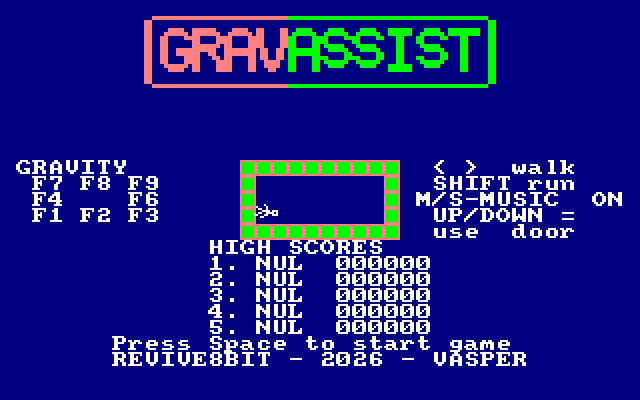

## Αίθουσες

| | |
|---|---|
| Αίθουσα 1 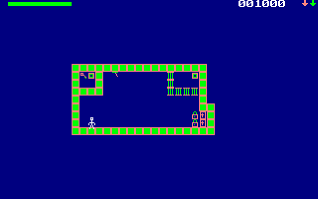 | Αίθουσα 2 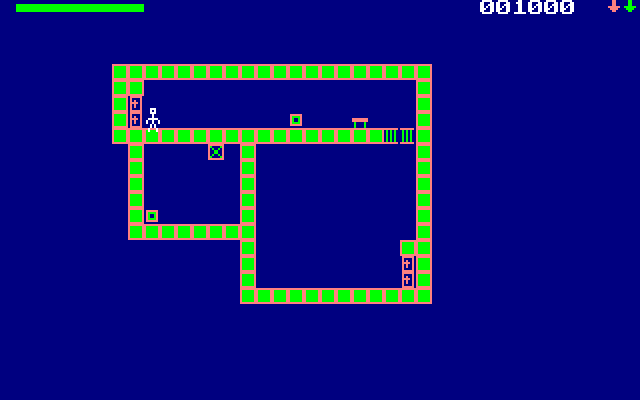 |
| Αίθουσα 3 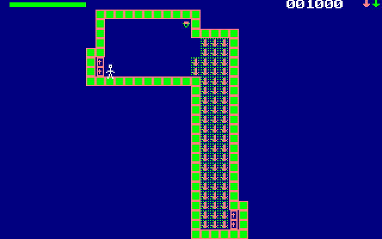 | Αίθουσα 4 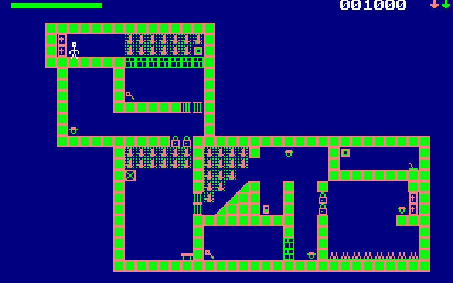 |
| Αίθουσα 5 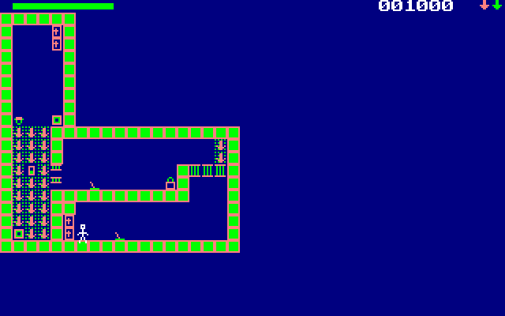 | Αίθουσα 6 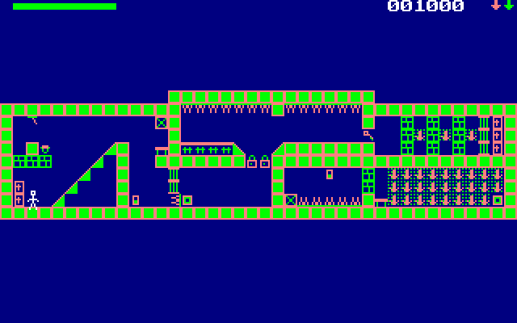 |
| Αίθουσα 7 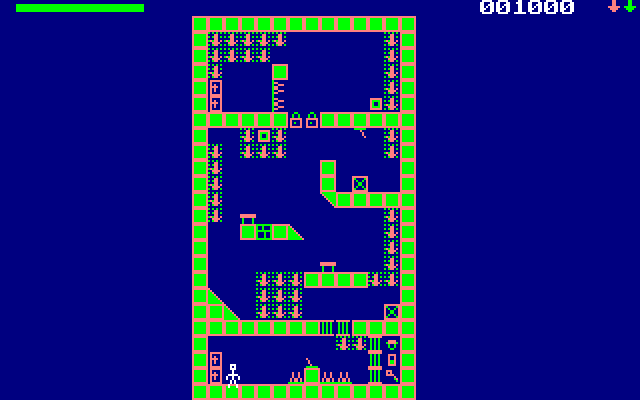 | Αίθουσα 8 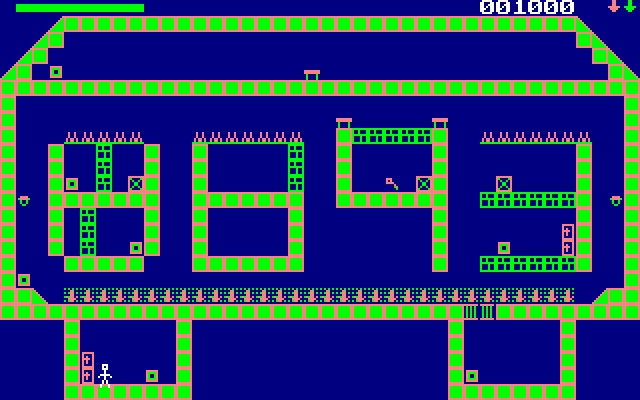 |
| Αίθουσα 9 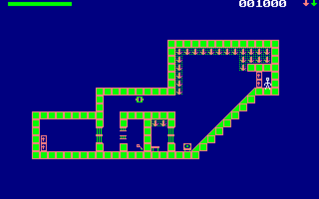 | Αίθουσα 10 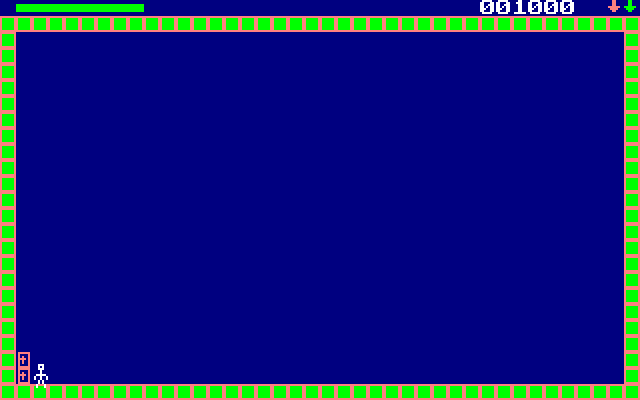 |
